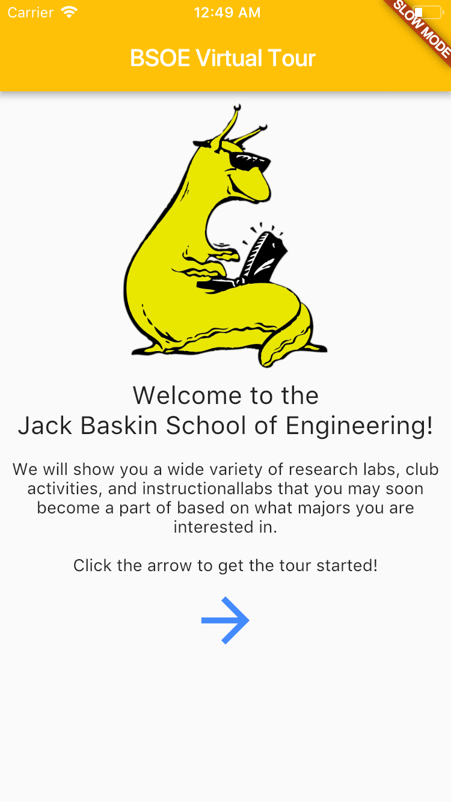
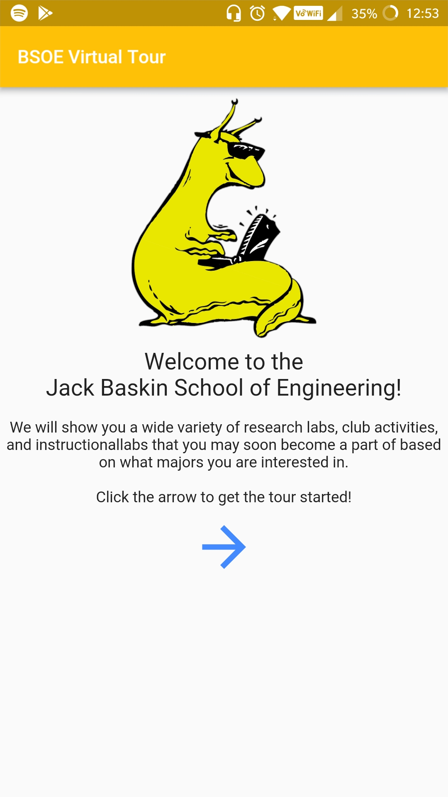
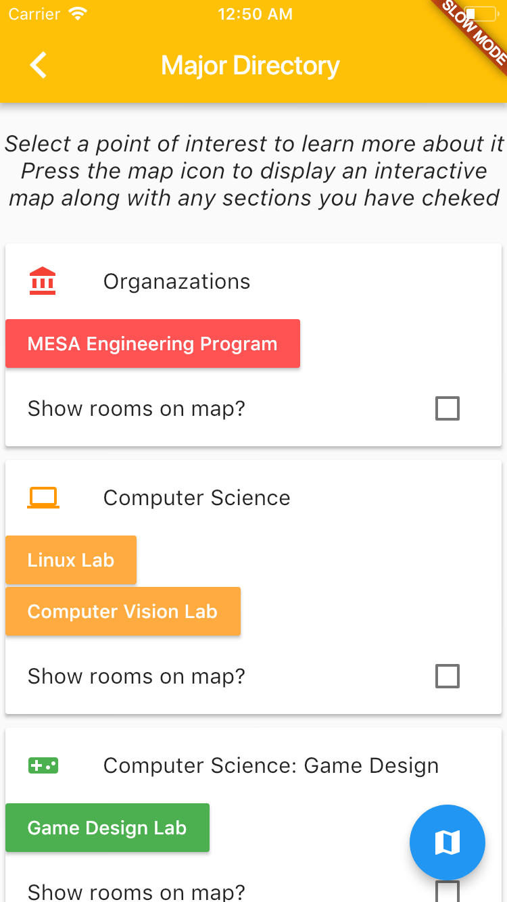
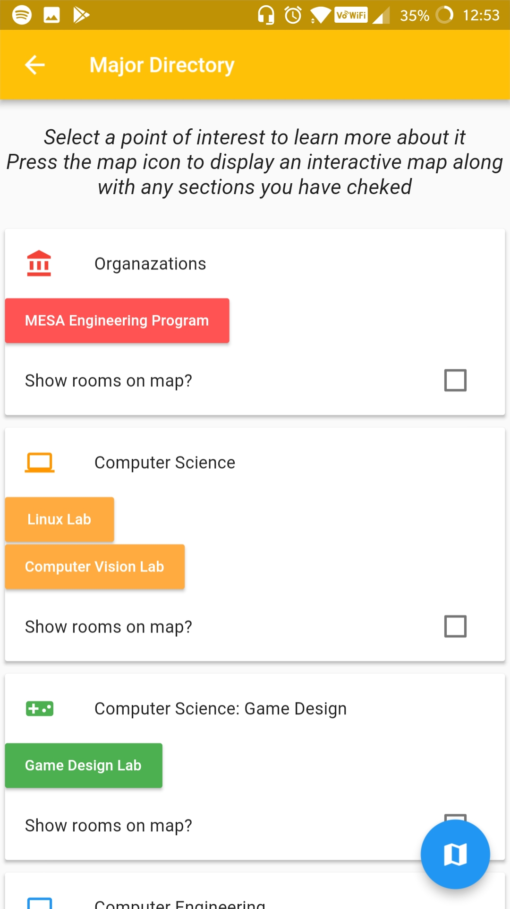
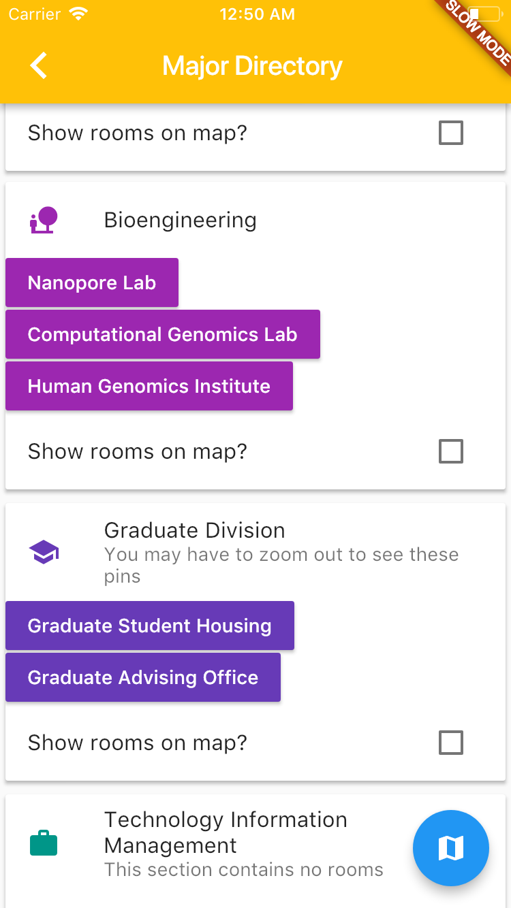
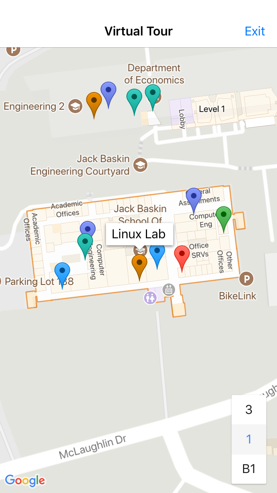
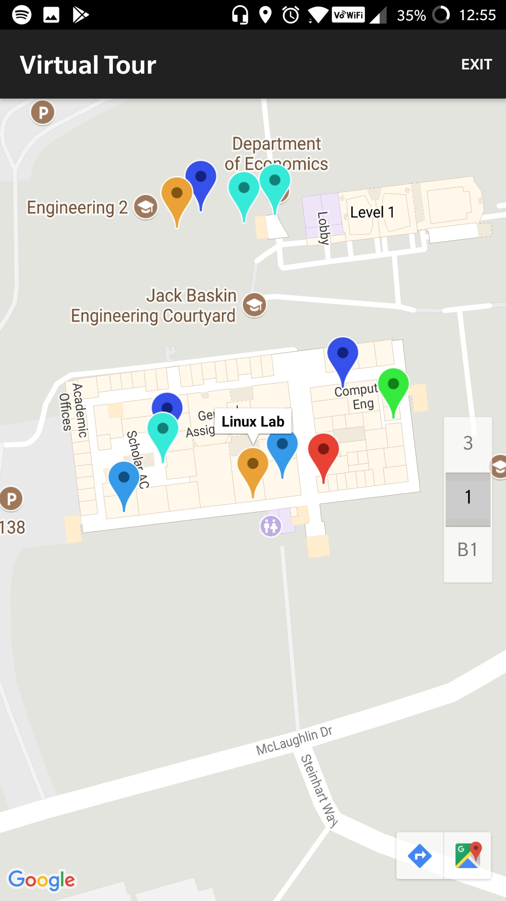

# Slug Tour

Slug tour is an open-sourced appliation meant to introduce new Banana Slugs to the wonderful world of Baskin Engineering. 🐌🍌 

## Screenshots
|   Welcome (iOS)	| Welcome (Android)  	|
|:-:	|:-:	|
|   	|   	|

|   Selection (iOS)	| Selection (Android)  	|
|:-:	|:-:	|
|   	|   	|

|   Selection-2 (iOS)	| Selection-2 (Android)  	|
|:-:	|:-:	|
|   	|   	|

|   Room (iOS)	| Room (Android)  	|
|:-:	|:-:	|
|   	|   	|

|   Map (iOS)	| Map (Android)  	|
|:-:	|:-:	|
|   	|   	|

## Todos
1. See issues
2. Get screenshots from actual ios device

## More about Flutter

For help getting started with Flutter, view our online
[documentation](https://flutter.io/).
