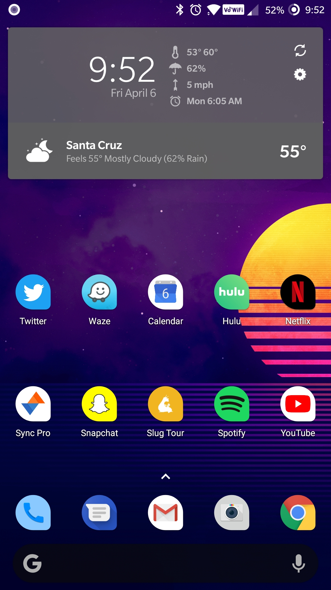
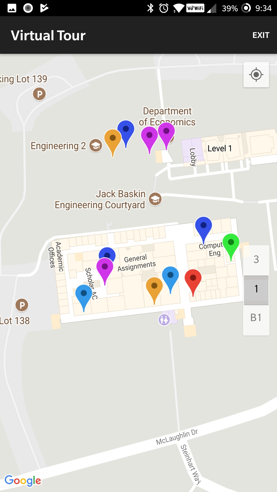

# Slug Tour

Slug tour is an open-sourced application meant to introduce new Banana Slugs to the wonderful world of Baskin Engineering. 🐌🍌 

## Screenshots
|   Launch Icon (iOS)	| Launch Icon (Android)  	|
|:-:	|:-:	|
|   	|   	|

|   Welcome (iOS)	| Welcome (Android)  	|
|:-:	|:-:	|
|   	|   	|

|   Selection (iOS)	| Selection (Android)  	|
|:-:	|:-:	|
|   	|   	|

|   Selection-2 (iOS)	| Selection-2 (Android)  	|
|:-:	|:-:	|
|   	|   	|

|   Room (iOS)	| Room (Android)  	|
|:-:	|:-:	|
|   	|   	|

|   Map (iOS)	| Map (Android)  	|
|:-:	|:-:	|
|   	|   	|

|   Map-2 (iOS)	| Map-2 (Android)  	|
|:-:	|:-:	|
|   	|   	|

## Todos
1. See issues
2. Push to play-store

## More information
The master branch on this repo contains the iOS related code for Slug Tour, whereas the android branch is dedicated for the Android related code.

## More about Flutter
For help getting started with Flutter, view our online
[documentation](https://flutter.io/).
